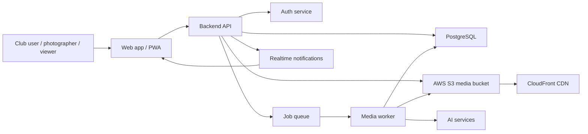

# EventVault Architecture

## System Overview

## Core Modules

- **Event Service**: Creates events, albums, metadata, category filters, and organizer controls.
- **Media Service**: Stores media metadata, upload state, access level, storage key, tags, and thumbnails.
- **Access Service**: Enforces role-based access for Admin, Photographer, Club Member, and Viewer.
- **Social Service**: Handles likes, comments, favourites, shares, downloads, friend tags, and notification events.
- **AI Service**: Generates image tags, captions, face embeddings, duplicate checks, and moderation labels.
- **Watermark Service**: Applies download-time dynamic watermarking based on club, event, and user role.
- **Notification Service**: Streams realtime updates for likes, comments, tags, uploads, and album shares.

## Upload Pipeline

1. Client asks the API for a signed upload URL.
2. Client uploads the original file directly to S3.
3. API creates a pending media record.
4. Worker compresses the file, creates thumbnails, extracts metadata, and runs AI tagging.
5. AI tags and derived asset paths are saved in PostgreSQL.
6. Notification service announces that the asset is ready.

## Access Control

Private media is never exposed through public object URLs. The API validates user role and album membership before issuing signed read URLs.

| Role | Event Admin | Upload | Private View | Moderate |
| --- | --- | --- | --- | --- |
| Admin | Yes | Yes | Yes | Yes |
| Photographer | Assigned | Yes | Assigned | Own uploads |
| Club Member | No | No | Yes | No |
| Viewer | No | No | No | No |

## Scalability Decisions

- S3 and CDN keep heavy media traffic away from the app server.
- Workers handle slow tasks outside request-response flows.
- Search indexes can be backed by PostgreSQL full-text search initially, then OpenSearch for scale.
- Face embeddings should be stored separately from raw images and protected with strict retention rules.
- Watermarking can be generated on demand and cached per media/user-role combination.
